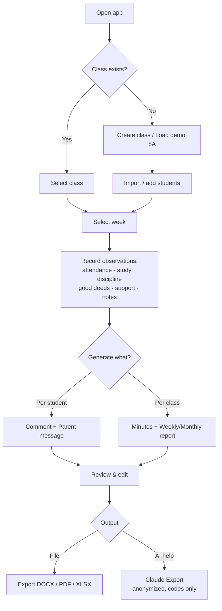
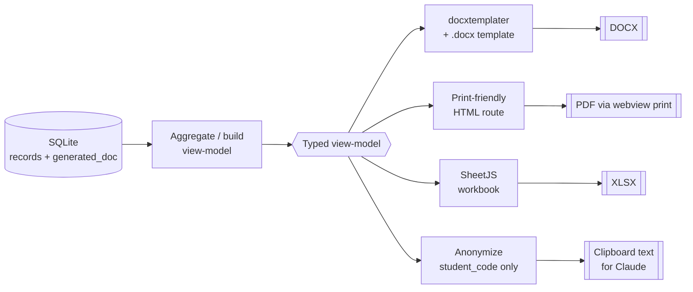
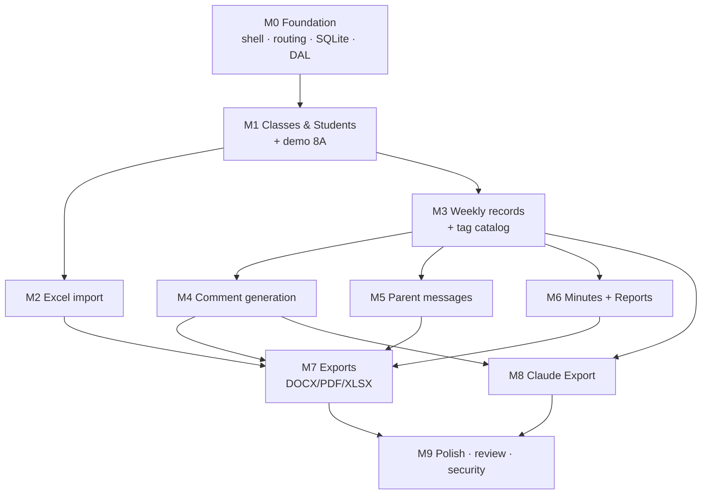

# Spec: GVCN AutoReport — MVP

> Status: **Draft for review** (Define + Plan phase). No implementation yet.
> Owner: Homeroom-teacher tooling. Last updated: 2026-06-26.

## 1. Objective

Build a **local-first desktop app** that helps a Vietnamese lower-secondary (THCS)
**homeroom teacher (giáo viên chủ nhiệm — GVCN)** turn weekly classroom observations
into respectful, ready-to-use written outputs:

- student comments (nhận xét học sinh),
- parent-message drafts (tin nhắn phụ huynh),
- homeroom meeting minutes (biên bản họp lớp / sinh hoạt lớp),
- weekly/monthly homeroom reports (báo cáo tuần / tháng),
- evidence exports for the "giáo viên chủ nhiệm giỏi" workflow.

**Success looks like:** a teacher can, in one sitting and fully offline, import class
8A, record a week of observations, and export a DOCX/PDF/XLSX report plus an
anonymized "Claude Export" summary — without any real student data leaving the machine.

**Explicit non-goals (MVP):** no full school ERP, no grades/transcript engine, no
multi-role accounts, no cloud sync, no automatic AI API calls, no surveillance or
behavior-scoring features.

## 2. Primary User

- **Who:** One THCS homeroom teacher managing one or more homeroom classes (~30–45 students each).
- **Context:** Works on a personal Windows or macOS laptop, often offline, in Vietnamese.
- **Skill level:** Comfortable with Word/Excel; not a developer. Edits `.docx` templates by hand.
- **Pain today:** Hand-writing repetitive, individualized Vietnamese comments and reports
  for every student every week/month; assembling evidence for teaching-excellence reviews.
- **Secondary (out of MVP):** subject teachers, school admin, parents — not represented as app roles.

## 3. Main User Flows

1. **Set up class** → create class 8A (or load demo) → import/add students.
2. **Record a week** → pick class + week → for each student tag attendance / study /
   discipline / good deeds / support-needed, add a short note.
3. **Generate text** → from a student's records, generate an editable comment and a
   parent-message draft → teacher reviews/edits → save.
4. **Generate class artifacts** → generate weekly/monthly report and meeting minutes
   for the class/week from aggregated records.
5. **Export** → produce DOCX / PDF / XLSX of any generated artifact.
6. **Claude Export** → produce an anonymized (student-code-only) text summary for manual
   copy-paste into Claude, when the teacher wants AI help.

See [§9 Diagrams](#9-diagrams) for the flow diagram.

## 4. MVP Screens

| # | Screen | Purpose | Key states |
|---|--------|---------|-----------|
| 1 | **App shell** | Sidebar nav, class switcher, offline indicator | — |
| 2 | **Dashboard** | Current class overview, quick stats, jump-ins | empty / loading |
| 3 | **Classes** | List/create/edit classes; load demo 8A | empty |
| 4 | **Students** | Roster table per class; add/edit; **Import from Excel** | empty / import-preview / row-error |
| 5 | **Weekly Record** | Pick class+week; per-student tag+note entry grid | no-week / unsaved |
| 6 | **Comments** | Generate + edit student comments from records | no-data / generated |
| 7 | **Parent Messages** | Generate + edit cooperative parent drafts | no-data / generated |
| 8 | **Meeting Minutes** | Generate weekly homeroom minutes for class | no-data / generated |
| 9 | **Reports** | Weekly/monthly homeroom report preview | no-data / generated |
| 10 | **Exports** | Export current artifact to DOCX / PDF / XLSX | success / error |
| 11 | **Claude Export** | Anonymized copy-paste summary (codes only) | — |
| 12 | **Settings** | Teacher/school info, template paths, demo-data load | — |

All screens ship with explicit empty / loading / error states (per `frontend-ui-engineering`)
and Vietnamese UX copy by default.

## 5. Data Model

Local relational schema (SQLite). Tags use a controlled catalog + join table so generated
text stays consistent and translatable; free-text lives only in `note`/`teacher_notes`.

| Entity | Key fields | Notes |
|--------|-----------|-------|
| **class** | id, name (`"8A"`), school_year, homeroom_teacher, created_at | one row per homeroom class |
| **student** | id, class_id→class, student_code (unique in class), full_name, gender?, dob?, note?, is_active | `student_code` is the anonymization key |
| **week** | id, class_id→class, week_no, start_date, end_date, label | reporting period (also used for monthly grouping) |
| **tag** | id, category (`attendance`/`study`/`discipline`/`good_deed`/`support`), code, label_vi, sentiment (`positive`/`neutral`/`concern`) | controlled vocabulary; seeded |
| **weekly_record** | id, student_id→student, week_id→week, teacher_notes?, created_at, updated_at | one record per (student, week) |
| **record_tag** | record_id→weekly_record, tag_id→tag | many-to-many selected tags |
| **generated_doc** | id, kind (`comment`/`parent_msg`/`minutes`/`report`), scope (`student`/`class`), ref_id, week_id?, body_text, edited_by_user, created_at | stores reviewed/edited output; source of exports |

`student_code`, not `full_name`, is used in every AI/Claude export. See [§9 Diagrams](#9-diagrams) for the ER view.

## 6. Required Exports

| Artifact | DOCX | PDF | XLSX | Method |
|----------|:----:|:---:|:----:|--------|
| Student comments (per student / whole class) | ✅ | ✅ | ✅ | DOCX via template; PDF via print; XLSX via SheetJS |
| Parent-message drafts | ✅ | ✅ | — | template / print |
| Meeting minutes | ✅ | ✅ | — | template / print |
| Weekly/monthly report | ✅ | ✅ | ✅ | template / print / sheet |
| Roster / records | — | — | ✅ | SheetJS round-trip with import |
| Claude Export | — | — | — | plain text to clipboard, anonymized |

**Pipeline:** structured data → template/view → DOCX (`docxtemplater`) | PDF (webview print) |
XLSX (`SheetJS`). Templates live in `templates/` and are hand-editable `.docx`. See [§9](#9-diagrams).

## 7. Student-Data Safety Boundaries

- **Local-only.** All data stays in a local SQLite file; the app works fully offline.
- **No external AI calls** in MVP. The only AI path is the manual, anonymized Claude Export.
- **Anonymize by default.** Claude Export and any generated summary use `student_code` only —
  never names, phone numbers, addresses, grades, or family situations.
- **No real data in the repo.** Demo/seed data is fake (class 8A). Screenshots use fake data.
- **No surveillance framing.** Copy uses "ghi nhận / hỗ trợ / phối hợp / tiến bộ"; no
  behavior-scoring, ranking, or hidden monitoring.
- **Respectful output.** Generated comments/messages are specific, non-judgmental, and
  phrased as cooperation, never accusation. A lint/test guards against banned punitive phrasing.
- **Portable & deletable.** Data file location is known and documented; teacher can back up
  (copy the file) or delete it entirely.

## 8. MVP Acceptance Criteria

The MVP is "done" when, on a clean machine and offline:

1. App launches to an app shell with working sidebar navigation. *(Verify: `npm run tauri dev`.)*
2. Teacher can create a class and load demo class **8A** with fake students.
3. Teacher can **import a student list from `.xlsx`**; invalid rows are flagged and skipped, valid rows imported. *(Verify: import test.)*
4. Teacher can record a full week of observations (tags + notes) for students and re-open them. *(Verify: persisted across restart.)*
5. **Comment generation** produces an editable, respectful Vietnamese comment from a student's tags+notes. *(Verify: unit tests + no banned-phrase test.)*
6. **Parent-message generation** produces a cooperative Vietnamese draft. *(Verify: unit tests.)*
7. **Meeting minutes** and **weekly/monthly report** generate from aggregated class data. *(Verify: unit tests on aggregation.)*
8. Teacher can **export DOCX, PDF, and XLSX** that open correctly in Word/Excel/a PDF viewer with Vietnamese diacritics intact. *(Verify: manual open + structure test.)*
9. **Claude Export** produces an anonymized summary containing student codes and **no PII**. *(Verify: PII-absence test.)*
10. Every screen has empty/loading/error states; UX copy is Vietnamese. *(Verify: manual + component tests.)*
11. `npm run typecheck`, `npm run lint`, and `npm run test` pass. *(Verify: CI/local run.)*

## 9. Diagrams

### 9.1 Main teacher user flow



### 9.2 Conceptual data model

```mermaid
erDiagram
  CLASS ||--o{ STUDENT : has
  CLASS ||--o{ WEEK : defines
  STUDENT ||--o{ WEEKLY_RECORD : "recorded in"
  WEEK ||--o{ WEEKLY_RECORD : groups
  WEEKLY_RECORD ||--o{ RECORD_TAG : selects
  TAG ||--o{ RECORD_TAG : "used by"
  STUDENT ||--o{ GENERATED_DOC : "about (student)"
  CLASS ||--o{ GENERATED_DOC : "about (class)"

  CLASS { int id PK; string name; string school_year; string homeroom_teacher }
  STUDENT { int id PK; int class_id FK; string student_code; string full_name; bool is_active }
  WEEK { int id PK; int class_id FK; int week_no; date start_date; date end_date }
  TAG { int id PK; string category; string code; string label_vi; string sentiment }
  WEEKLY_RECORD { int id PK; int student_id FK; int week_id FK; string teacher_notes }
  RECORD_TAG { int record_id FK; int tag_id FK }
  GENERATED_DOC { int id PK; string kind; string scope; int ref_id; string body_text }
```

### 9.3 Export pipeline: data → template → DOCX / PDF / XLSX



### 9.4 MVP milestone dependency graph



## 10. Tech Stack & Key Decisions

Scaffold already present: **Tauri 2 + React 19 + TypeScript + Vite**. Decisions below
fill the gaps. Each: brief tradeoff, then one choice.

### 10.1 Local data layer → **SQLite via `tauri-plugin-sql`**
- **Options:** (a) SQLite through `@tauri-apps/plugin-sql`; (b) PocketBase; (c) in-webview IndexedDB/Dexie.
- **Tradeoff:** PocketBase adds a separate server process — heavier than a local-first single app needs. Dexie keeps data in webview storage: weaker relational queries and harder to back up/port as one file. SQLite is a single portable file, supports real relational queries + migrations, and the Tauri plugin keeps it in the Rust side (robust, easy `.db` backup).
- **Choice:** **SQLite + `tauri-plugin-sql`** with explicit SQL migrations and a thin typed data-access layer in `src/lib/db`.

### 10.2 DOCX / PDF / XLSX export
- **DOCX → `docxtemplater`.** Tradeoff: `docx` (programmatic) keeps layout in TS but non-devs can't tweak it; `docxtemplater` drives hand-editable `.docx` templates with `{placeholders}` — ideal for a teacher-owned template in `templates/`. **Choice: docxtemplater (free core).**
- **PDF → webview print-to-PDF from a print-friendly HTML route.** Tradeoff: `pdfmake` gives programmatic layout but you re-author every report in JS and must bundle Vietnamese fonts; the webview already renders Vietnamese correctly and "Save as PDF" is built in. **Choice: print-to-PDF for MVP; revisit `pdfmake` only if pixel-exact automation is needed.**
- **XLSX → `SheetJS` (xlsx).** Used for both import and export (round-trip). Tradeoff: heavier than hand-rolling CSV, but handles real `.xlsx`, diacritics, and multiple sheets. Note licensing: pin a known-good community edition and record it in `source-driven-development` notes. **Choice: SheetJS.**

### 10.3 Table / form / dashboard UI → **shadcn/ui (Radix + Tailwind) + TanStack Table + React Hook Form + Zod**
- **Tradeoff:** A component library (MUI/AntD) is faster to drop in but heavier and harder to restyle for Vietnamese print layouts; shadcn/ui is copy-in, fully ownable, and matches the `shadcn-admin` reference patterns we're adapting. TanStack Table handles roster sorting/filtering; React Hook Form + Zod give declarative validation for record entry and import.
- **Choice:** **shadcn/ui + Tailwind v4 + TanStack Table + React Hook Form + Zod.** (Adapts column/sidebar patterns from `references/repos/shadcn-admin`, MIT.)

### 10.4 Test approach → **Vitest + React Testing Library, TDD on pure logic**
- **Tradeoff:** Full E2E (Playwright/WebDriver against the Tauri binary) is valuable but heavy to stand up for an MVP. The highest-risk, most-testable logic is *pure*: comment/parent-message/report generation and Excel/DOCX/XLSX data mapping.
- **Choice:** **Vitest** for unit tests (TDD per `test-driven-development` on all generators, aggregation, import/export mappers, and the **no-PII / no-banned-phrase guards**), **RTL** for component states (empty/loading/error). Golden-file/snapshot tests for generated Vietnamese text and export view-models. E2E deferred to post-MVP; MVP relies on a reproducible manual demo checklist.

## 11. Commands

Current (scaffold): `npm run dev`, `npm run build`, `npm run preview`, `npm run tauri`.
To be added during M0 (state as "not configured yet" until then):

```
npm install
npm run dev            # Vite dev server (web)
npm run tauri dev      # Tauri desktop dev
npm run build          # tsc + vite build
npm run tauri build    # desktop bundle (DMG / EXE) — nice-to-have CI later
npm run test           # Vitest          (NOT configured yet)
npm run lint           # ESLint           (NOT configured yet)
npm run typecheck      # tsc --noEmit     (NOT configured yet)
```

## 12. Project Structure (target)

```
src/
  app/            → app shell, routing, providers
  components/ui/  → shadcn/ui components (owned, copy-in)
  features/       → classes, students, records, comments, parent-messages,
                    minutes, reports, exports, claude-export   (per-feature: components, schema.ts (Zod), hooks)
  lib/
    db/           → SQLite access + migrations + typed queries
    generate/     → pure generators (comment, parent-msg, minutes, report) — unit-tested
    export/       → docx / pdf / xlsx / claude mappers
    i18n/         → Vietnamese UX copy
  test/           → test helpers, fixtures (fake data)
src-tauri/        → Tauri shell (sql plugin, fs/dialog capabilities)
templates/        → hand-editable .docx templates
docs/             → ADRs, product notes
tasks/            → plan.md, todo.md
tests/ or *.test.ts colocated → Vitest
```

## 13. Boundaries

- **Always:** keep data local/offline; use fake demo data; anonymize AI/Claude exports to
  student codes; write tests for generators and import/export; Vietnamese UX copy; respectful,
  cooperative tone; small verifiable changes; update this spec when the model/flow/templates change.
- **Ask first:** adding dependencies, changing the data model, changing export templates,
  any networked feature, expanding scope beyond the MVP screen list.
- **Never:** send real student data anywhere; commit real PII or secrets; build surveillance /
  behavior-scoring; generate punitive or stigmatizing text; treat reference repos as the app
  architecture or copy large chunks without checking license; turn this into a school ERP.

## 14. Open Questions / Risks

| # | Item | Impact | Note / proposed default |
|---|------|--------|--------------------------|
| 1 | **`tauri.conf.json` `identifier` is `"mkdir -p .claude/skills"`** — a scaffold copy-paste bug; invalid bundle identifier. | High (breaks `tauri build`) | Fix in M0 to e.g. `com.gvcn.autoreport`. Flagging, not fixing this session. |
| 2 | Default window is 800×600 — small for tables/forms. | Low | Bump to ~1200×800 in M0. |
| 3 | Vietnamese grading/observation taxonomy not finalized. | Medium | MVP seeds a small tag catalog; confirm categories/labels with the teacher before M3. |
| 4 | "Week" vs "month" reporting: monthly report derived by grouping weeks vs separate period entity. | Medium | Default: derive monthly from weeks; revisit if teachers track months independently. |
| 5 | DOCX template ownership/format (who authors the official "GVCN giỏi" template). | Medium | MVP ships a generic template in `templates/`; real template to be supplied later. |
| 6 | SheetJS licensing/edition to pin. | Low | Record chosen edition + version under `source-driven-development` notes in M2. |
| 7 | PDF fidelity via webview print may vary by OS print dialog. | Low | Acceptable for MVP; `pdfmake` is the documented fallback. |
| 8 | No multi-class bulk operations specified. | Low | Out of MVP; one class at a time. |

> Per `spec-driven-development`, this spec is a **gate**: review/approve before Plan → Tasks → Implement.
> Planning detail lives in [`tasks/plan.md`](tasks/plan.md); the checklist in [`tasks/todo.md`](tasks/todo.md).
